# 16-825 Assignment 1: Rendering Basics with PyTorch3D (Total: 100 Points + 10 Bonus)

Goals: In this assignment, you will learn the basics of rendering with PyTorch3D,
explore 3D representations, and practice constructing simple geometry.

You may also find it helpful to follow the [Pytorch3D tutorials](https://github.com/facebookresearch/pytorch3d).

## Table of Contents
0. [Setup](#0-setup)
1. [Practicing with Cameras](#1-practicing-with-cameras-15-points) (15 Points)
2. [Practicing with Meshes](#2-practicing-with-meshes-10-points) (10 Points)
3. [Re-texturing a mesh](#3-re-texturing-a-mesh-10-points) (10 Points)
4. [Camera Transformations](#4-camera-transformations-10-points) (10 Points)
5. [Rendering Generic 3D Representations](#5-rendering-generic-3d-representations) (45 Points)
6. [Do Something Fun](#6-do-something-fun-10-points) (10 Points)
7. [Extra Credit](#extra-credit-7-sampling-points-on-meshes-10-points) (10 Points)

## 0. Setup

You will need to install Pytorch3d. See the directions for your platform
[here](https://github.com/facebookresearch/pytorch3d/blob/main/INSTALL.md).
You will also need to install Pytorch. If you do not have a GPU, you can directly pip
install it (`pip install torch`). Otherwise, follow the installation directions
[here](https://pytorch.org/get-started/locally/).

Other miscellaneous packages that you will need can be installed using the 
`requirements.txt` file (`pip install -r requirements.txt`).

If you have access to a GPU, the rendering code may run faster, but everything should
be able to run locally on a CPU. Below are some sample installation instructions for a Linux Machine. 

For GPU installation, we recommend CUDA>=11.6.

```bash
# GPU Installation on a CUDA 11.6 Machine
conda create -n learning3d python=3.10
conda activate learning3d
pip install torch --index-url https://download.pytorch.org/whl/cu116 # Modify according to your cuda version. For example, cu121 for CUDA 12.1
pip install fvcore iopath
conda install -c bottler nvidiacub (required for CUDA older than 11.7)
MAX_JOBS=8 pip install "git+https://github.com/facebookresearch/pytorch3d.git@stable" # This will take some time to compile!
pip install -r requirements.txt

# CPU Installation
conda create -n learning3d python=3.10
conda activate learning3d
pip install torch --index-url https://download.pytorch.org/whl/cpu
pip install fvcore iopath
MAX_JOBS=8 pip install "git+https://github.com/facebookresearch/pytorch3d.git@stable"
pip install -r requirements.txt

```

Make sure that you have gcc $\ge$ 4.9.

### 0.1 Rendering your first mesh

To render a mesh using Pytorch3D, you will need a mesh that defines the geometry and
texture of an object, a camera that defines the viewpoint, and a Pytorch3D renderer
that encapsulates rasterization and shading parameters. You can abstract away the
renderer using the `get_mesh_renderer` wrapper function in `utils.py`:
```python
renderer = get_mesh_renderer(image_size=512)
```

Meshes in Pytorch3D are defined by a list of vertices, faces, and texture information.
We will be using per-vertex texture features that assign an RGB color to each vertex.
You can construct a mesh using the `pytorch3d.structures.Meshes` class:
```python
vertices = ...  # 1 x N_v x 3 tensor.
faces = ...  # 1 x N_f x 3 tensor.
textures = ...  # 1 x N_v x 3 tensor.
meshes = pytorch3d.structures.Meshes(
    verts=vertices,
    faces=faces,
    textures=pytorch3d.renderer.TexturesVertex(textures),
)
```
Note that Pytorch3D assumes that meshes are *batched*, so the first dimension of all
parameters should be 1. You can easily do this by calling `tensor.unsqueeze(0)` to add
a batch dimension.

Cameras can be constructed using a rotation, translation, and field-of-view
(in degrees). A camera with identity rotation placed 3 units from the origin can be
constructed as follows:
```python
cameras = pytorch3d.renderer.FoVPerspectiveCameras(
    R=torch.eye(3).unsqueeze(0),
    T=torch.tensor([[0, 0, 3]]),
    fov=60,
)
```
Again, the rotation and translations must be batched. **You should familiarize yourself
with the [camera coordinate system](https://pytorch3d.org/docs/cameras) that Pytorch3D
uses. This will save you a lot of headaches down the line.**

Finally, to render the mesh, call the `renderer` on the mesh, camera, and lighting
(optional). Our light will be placed in front of the cow at (0, 0, -3).
```python
lights = pytorch3d.renderer.PointLights(location=[[0, 0, -3]])
rend = renderer(mesh, cameras=cameras, lights=lights)
image = rend[0, ..., :3].numpy()
```
The output from the renderer is B x H x W x 4. Since our batch is one, we can just take
the first element of the batch to get an image of H x W x 4. The fourth channel contains
silhouette information that we will ignore, so we will only keep the 3 RGB channels.

An example of the entire process is available in `starter/render_mesh.py`, which loads
a sample cow mesh and renders it. Please take a close look at the code and make sure
you understand how it works. If you run `python -m starter.render_mesh`, you should see
the following output:

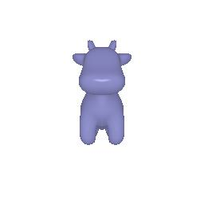

## 1. Practicing with Cameras (15 Points)

### 1.1. 360-degree Renders (5 points)

Your first task is to create a 360-degree gif video that shows many continuous views of the
provided cow mesh. For many of your results this semester, you will be expected to show
full turntable views of your outputs. You may find the following helpful:
* [`pytorch3d.renderer.look_at_view_transform`](https://pytorch3d.readthedocs.io/en/latest/modules/renderer/cameras.html#pytorch3d.renderer.cameras.look_at_view_transform):
Given a distance, elevation, and azimuth, this function returns the corresponding
set of rotations and translations to align the world to view coordinate system.
* Rendering a gif given a set of images:
```python
import imageio
my_images = ...  # List of images [(H, W, 3)]
duration = 1000 // 15  # Convert FPS (frames per second) to duration (ms per frame)
imageio.mimsave('my_gif.gif', my_images, duration=duration)
```
You can pass an additional argument `loop=0` to `imageio.mimsave` to make the gif loop.


> <g>**Submission**</g>: On your webpage, you should include a gif that shows the cow mesh from many
continuously changing viewpoints.


### 1.2 Re-creating the Dolly Zoom (10 points)

The [Dolly Zoom](https://en.wikipedia.org/wiki/Dolly_zoom) is a famous camera effect,
first used in the Alfred Hitchcock film
[Vertigo](https://www.youtube.com/watch?v=G7YJkBcRWB8).
The core idea is to change the focal length of the camera while moving the camera in a
way such that the subject is the same size in the frame, producing a rather unsettling
effect.

In this task, you will recreate this effect in Pytorch3D, producing an output that
should look something like this:

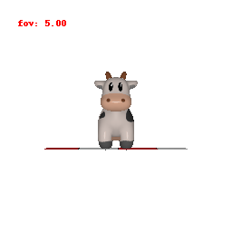

You will make modifications to `starter/dolly_zoom.py`. You can render your gif by
calling `python -m starter.dolly_zoom`.

> <g>**Submission**</g>: On your webpage, include a gif with your dolly zoom effect.

## 2. Practicing with Meshes (10 Points)

### 2.1 Constructing a Tetrahedron (5 points)

In this part, you will practice working with the geometry of 3D meshes.
Construct a tetrahedron mesh and then render it from multiple viewpoints. 
Your tetrahedron does not need to be a regular
tetrahedron (i.e. not all faces need to be equilateral triangles) as long as it is
obvious from the renderings that the shape is a tetrahedron.

You will need to manually define the vertices and faces of the mesh. Once you have the
vertices and faces, you can define a single-color texture, similarly to the cow in
`render_mesh.py`. Remember that the faces are the vertex indices of the triangle mesh. 

It may help to draw a picture of your tetrahedron and label the vertices and assign 3D
coordinates.

> <g>**Submission**</g>: On your webpage, show a 360-degree gif animation of your tetrahedron.
Also, list how many vertices and (triangle) faces your mesh should have.

### 2.2 Constructing a Cube (5 points)

Construct a cube mesh and then render it from multiple viewpoints. Remember that we are
still working with triangle meshes, so you will need to use two sets of triangle faces
to represent one face of the cube.

> <g>**Submission**</g>: On your webpage, show a 360-degree gif animation of your cube.
Also, list how many vertices and (triangle) faces your mesh should have.


## 3. Re-texturing a mesh (10 points)

Now let's practice re-texturing a mesh. For this task, we will be retexturing the cow
mesh such that the color smoothly changes from the front of the cow to the back of the
cow.

More concretely, you will pick 2 RGB colors, `color1` and `color2`. We will assign the
front of the cow a color of `color1`, and the back of the cow a color of `color2`.
The front of the cow corresponds to the vertex with the smallest z-coordinate `z_min`,
and the back of the cow corresponds to the vertex with the largest z-coordinate `z_max`.
Then, we will assign the color of each vertex using linear interpolation based on the
z-value of the vertex:
```python
alpha = (z - z_min) / (z_max - z_min)
color = alpha * color2 + (1 - alpha) * color1
```

Your final output should look something like this:


In this case, `color1 = [0, 0, 1]` and `color2 = [1, 0, 0]`.

> <g>**Submission**</g>: In your submission, describe your choice of `color1` and `color2`, and include a gif of the rendered mesh.

## 4. Camera Transformations (10 points)

When working with 3D, finding a reasonable camera pose is often the first step to
producing a useful visualization, and an important first step toward debugging.

Running `python -m starter.camera_transforms` produces the following image using
the camera extrinsics rotation `R_0` and translation `T_0`:

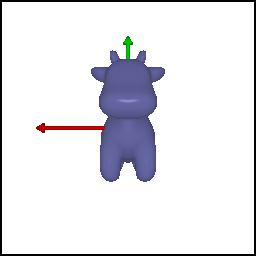


What are the relative camera transformations that would produce each of the following
output images? You should find a set (R_relative, T_relative) such that the new camera
extrinsics with `R = R_relative @ R_0` and `T = R_relative @ T_0 + T_relative` produces
each of the following images:


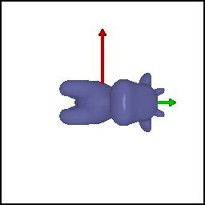
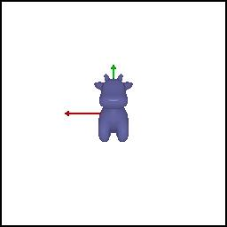
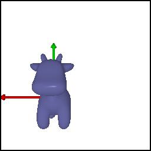
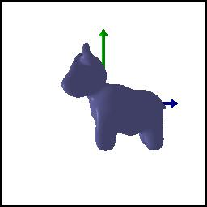

> <g>**Submission**</g>: In your report, describe in words what R_relative and T_relative should be doing and include the rendering produced by your choice of R_relative and T_relative.


## 5. Rendering Generic 3D Representations (45 Points)

The simplest possible 3D representation is simply a collection of 3D points, each
possibly associated with a color feature. PyTorch3D provides functionality for rendering
point clouds.

Similar to the mesh rendering, we will need a `PointCloud` object consisting of 3D
points and colors, a camera from which to view the point cloud, and a Pytorch3D Point 
Renderer which we have wrapped similarly to the Mesh Renderer.

To construct a point cloud, use the `PointCloud` class:
```python
points = ...  # 1 x N x 3
rgb = ...  # 1 x N x 3
point_cloud = pytorch3d.structures.PointCloud(
    points=points, features=rgb
)
```
As with all the mesh rendering, everything should be batched.

The point renderer takes in a point cloud and a camera and returns a B x H x W x 4
rendering, similar to the mesh renderer.
```
from starter.utils import get_points_renderer
points_renderer = get_points_renderer(
    image_size=256,
    radius=0.01,
)
rend = points_renderer(point_cloud, cameras=cameras)
image = rend[0, ..., :3].numpy()  # (B, H, W, 4) -> (H, W, 3).
```

To see a full working example of rendering a point cloud, see `render_bridge` in
`starter/render_generic.py`.

If you run `python -m starter.render_generic --render point_cloud`, you should
get the following output:


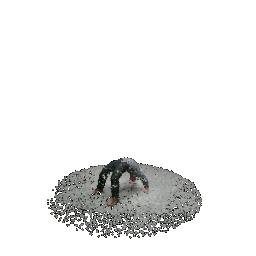


### 5.1 Rendering Point Clouds from RGB-D Images (10 points)

In this part, we will practice rendering point clouds constructed from 2 RGB-D images
from the [Common Objects in 3D Dataset](https://github.com/facebookresearch/co3d).


In `render_generic.py`, the `load_rgbd_data` function will load the data for 2 images of the same
plant. The dictionary should contain the RGB image, a depth map, a mask, and a
Pytorch3D camera corresponding to the pose that the image was taken from.

You should use the `unproject_depth_image` function in `utils.py` to convert a depth
image into a point cloud (parameterized as a set of 3D coordinates and corresponding
color values). The `unproject_depth_image` function uses the camera
intrinsics and extrinisics to cast a ray from every pixel in the image into world 
coordinates space. The ray's final distance is the depth value at that pixel, and the
color of each point can be determined from the corresponding image pixel.

Construct 3 different point clouds:
1. The point cloud corresponding to the first image
2. The point cloud corresponding to the second image
3. The point cloud formed by the union of the first 2 point clouds.

Try visualizing each of the point clouds from various camera viewpoints. We suggest
starting with cameras initialized 6 units from the origin with equally spaced azimuth
values.

> <g>**Submission**</g>:  In your submission, include a gif of each of these point clouds mentioned above side-by-side.

### 5.2 Parametric Functions (10 + 5 points)

A parametric function generates a 3D point for each point in the source domain.
For example, given an elevation `theta` and azimuth `phi`, we can parameterize the
surface of a unit sphere as
`(sin(theta) * cos(phi), cos(theta), sin(theta) * sin(phi))`.

By sampling values of `theta` and `phi`, we can generate a sphere point cloud.
You can render a sphere point cloud by calling `python -m starter.render_generic --render parametric`.
Note that the amount of samples can have an effect on the appearance quality. Below, we show the
output with a 100x100 grid of (phi, theta) pairs (`--num_samples 100`) as well as a 
1000x1000 grid (`--num_samples 1000`). The latter may take a long time to run on CPU.

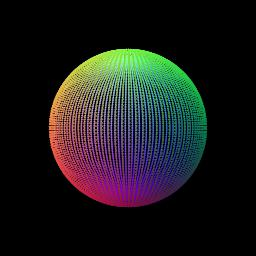
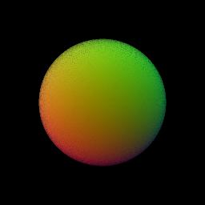

Your task is to render a [torus](https://en.wikipedia.org/wiki/Torus) point cloud by
sampling its parametric function.

> <g>**Submission**</g>:
> -  In your writeup, include a 360-degree gif of your torus point cloud, and make sure the hole is visible. You may choose to texture your point cloud however you wish. (10 points)
> - Include a 360-degree gif on any new object of your choice. (5 points)


### 5.3 Implicit Surfaces (15 + 5 points)

In this part, we will explore representing geometry as a function in the form of an implicit function.
In general, given a function F(x, y, z), we can define the surface to be the zero level-set of F i.e.
(x,y,z) such that F(x, y, z) = 0. The function F can be a mathematical equation or even a neural
network.
To visualize such a representation, we can discretize the 3D space and evaluate the
implicit function, storing the values in a voxel grid.
Finally, to recover the mesh, we can run the
[marching cubes](https://en.wikipedia.org/wiki/Marching_cubes) algorithm to extract
the 0-level set.

In practice, we can generate our voxel coordinates using `torch.meshgrid` which we will
use to query our function (in this case mathematical ones).
Once we have our voxel grid, we can use the 
[`mcubes`](https://github.com/pmneila/PyMCubes) library to convert it into a mesh.

A sample sphere mesh can be constructed implicitly and rendered by calling
`python -m starter.render_generic --render implicit`.
The output should like like this:

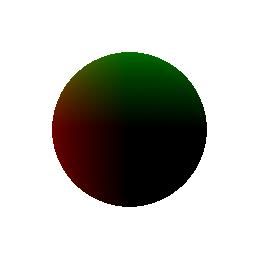

Your task is to render a torus again, this time as a mesh defined by an implicit
function.

> <g>**Submission**</g>:
> -  In your writeup, include a 360-degree gif of your torus mesh, and make sure the hole
is visible. (10 points)
> - In addition, discuss some of the tradeoffs between rendering as a mesh
vs a point cloud. Things to consider might include rendering speed, rendering quality,
ease of use, memory usage, etc. (5 points)
> - Include a 360-degree gif on any new object of your choice. This object can be different from what you used in 5.2 (5 points)

****

## 6. Do Something Fun (10 points)

Now that you have learned to work with various 3D represenations and render them, it
is time to try something fun. Create your own 3D structures, or render something in an interesting way,
or creatively texture, or anything else that appeals to you - the (3D) world is your oyster!
If you wish to download additional meshes,  [Free3D](https://free3d.com/) is a good place to start.

> <g>**Submission**</g>: Include a creative use of the tools in this assignment on your webpage!

## (Extra Credit) 7. Sampling Points on Meshes (10 points)

We will explore how to obtain point clouds from triangle meshes.
One obvious way to do this is to simply discard the face information and treat the vertices as a point cloud.
However, this might be unreasonable if the faces are not of equal size.


Instead, as we saw in the lectures, a solution to this problem is to use a uniform sampling of the surface using
stratified sampling. The procedure is as follows:

1. Sample a face with probability proportional to the area of the face
2. Sample a random [barycentric coordinate](https://en.wikipedia.org/wiki/Barycentric_coordinate_system) uniformly
3. Compute the corresponding point using baricentric coordinates on the selected face.


For this part, write a function that takes a triangle mesh and the number of samples
and outputs a point cloud. Then, using the cow mesh, randomly sample 10, 100, 1000, and
10000 points. 

> <g>**Submission**</g>: Render each pointcloud and the original cow mesh side-by-side, and
include the gif in your writeup.
